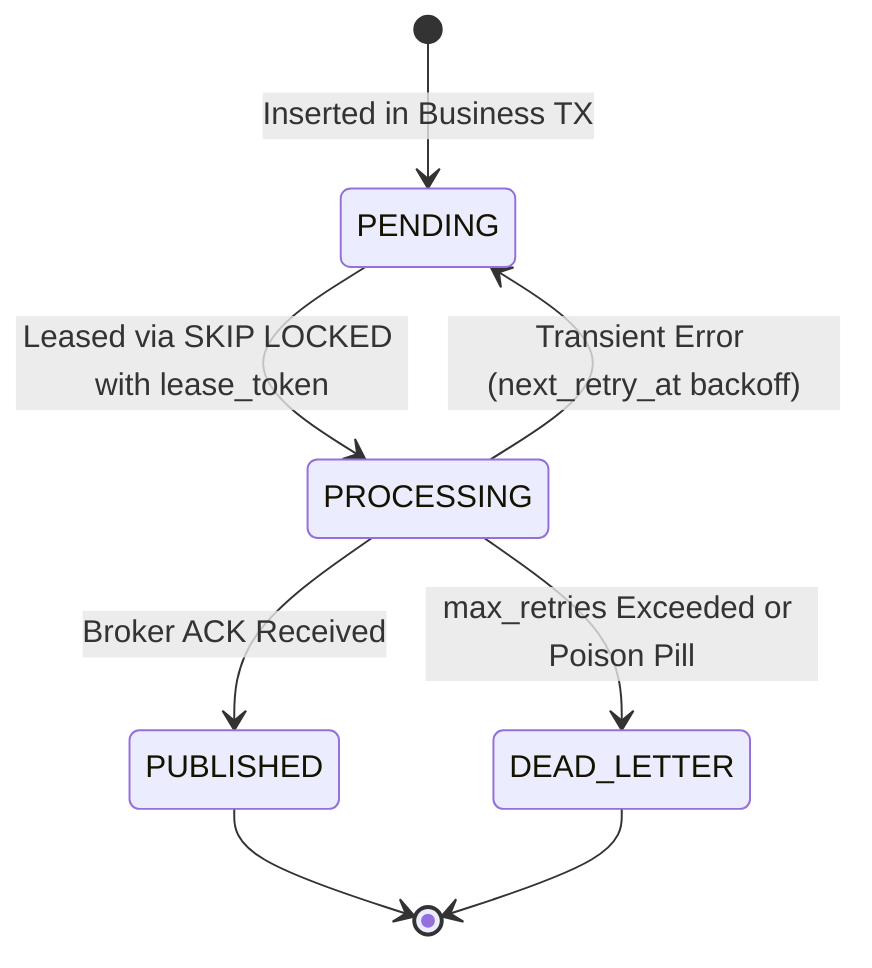

# ADR 0001: Transactional Outbox State Machine, Horizontal Leasing, and Poison-Pill Handling

- **Status**: Accepted
- **Date**: 2026-09-08
- **Deciders**: Backend Architecture Guild, Data Platform Team
- **Consulted**: SRE, Security

---

## Context and Problem Statement

Distributed microservices must publish domain events (such as `InvoiceIssued`, `PaymentSettled`, `VendorOnboarded`) to external message brokers (e.g., Apache Kafka, RabbitMQ) or webhook endpoints. Directly writing to a database and then performing a network RPC introduces the classic dual-write failure:
- If the database commit succeeds but the network publish fails (or the pod terminates), the event is lost forever.
- If the network publish succeeds but the database transaction rolls back, external consumers process phantom data.

The **Transactional Outbox Pattern** solves dual-writes by persisting events into an `outbox_events` table within the same ACID database transaction as the business entity mutation.

However, operating an outbox relay across high-volume, multi-replica Kubernetes deployments introduces significant concurrency challenges:
1. **Duplicate Processing & Lock Contention**: Naive polling (`SELECT * WHERE status='PENDING' LIMIT N`) causes multiple poller workers to pick up the same records, resulting in redundant broker messages. Traditional table or row locks (`SELECT ... FOR UPDATE`) cause concurrent pollers to block and serialize, degrading throughput.
2. **Thundering Herds**: Fixed-interval retries cause failed messages to retry simultaneously in synchronized bursts, overwhelming downstream brokers.
3. **Queue Stalling (Poison Pills)**: A malformed payload or unrecoverable external dependency error can cause an event to fail repeatedly, exhausting retry loops and blocking subsequent valid events.
4. **Dialect Fragmentation**: Attempting to abstract across incompatible SQL engines without native testing creates subtle race conditions and broken driver guarantees.

## Decision Drivers

- **At-Least-Once Delivery**: Zero lost events under application crashes, network timeouts, or pod restarts.
- **Horizontal Scalability**: $N$ independent microservice pods must poll the outbox table concurrently without lock contention or duplicate leases.
- **Index-Optimized Throughput**: Query execution must use B-tree index lookups and avoid full table sequential scans under millions of historical records.
- **Poison-Pill Quarantine**: Permanently failing events must transition to a terminal quarantine state (`dead_letter`) to preserve queue throughput.
- **Dialect Fidelity**: Strict adherence to PostgreSQL (`github.com/jackc/pgx/v5`) primitives rather than superficial multi-dialect abstractions.

## Considered Options

1. **Option 1**: Distributed lock via Redis/etcd orchestrating a single leader poller.
2. **Option 2**: PostgreSQL CDC (Change Data Capture) via Debezium and logical replication slots.
3. **Option 3**: Database-native row-level leasing using `SELECT ... FOR UPDATE SKIP LOCKED` with composite index and a multi-state machine in PostgreSQL.

## Decision Outcome

**Chosen Option: Option 3 (PostgreSQL Row-Level Leasing with State Machine).**

### 1. State Machine Lifecycle

Every outbox event transitions through an explicit state machine:



- **`PENDING`**: Event transactionally committed alongside business state, or awaiting scheduled retry backoff (`next_retry_at`).
- **`PROCESSING`**: Event leased with fencing token (`lease_token`) and expiration (`locked_until`).
- **`PUBLISHED`**: Terminal success state indicating broker acknowledgment. Includes `published_at` timestamp.
- **`DEAD_LETTER`**: Terminal quarantine state for poison pills or exhausted retries (`retry_count >= max_retries`). Excluded from subsequent poll queries.

### 2. Zero-Contention Row-Level Leasing

Pollers fetch batches using PostgreSQL's row-level locking with `SKIP LOCKED`:

```sql
SELECT id, aggregate_type, aggregate_id, event_type, payload, status,
       retry_count, max_retries, COALESCE(last_error, ''), scheduled_at, next_retry_at, published_at, created_at
FROM outbox_events
WHERE status IN ('PENDING', 'PROCESSING')
  AND next_retry_at <= NOW()
ORDER BY status ASC, next_retry_at ASC, created_at ASC
LIMIT $1
FOR UPDATE SKIP LOCKED;
```

When multiple worker replicas execute this query simultaneously, PostgreSQL locks only the returned rows and automatically skips rows currently locked by other transactions. This achieves linear horizontal scaling without distributed lock managers.

### 3. Composite Indexing Architecture

To support high-throughput polling without sequential table scans, the schema establishes:

```sql
CREATE INDEX IF NOT EXISTS idx_outbox_poll 
    ON outbox_events (status, next_retry_at, created_at);

CREATE INDEX IF NOT EXISTS idx_outbox_aggregate 
    ON outbox_events (aggregate_type, aggregate_id, created_at DESC);
```

- `idx_outbox_poll` covers the exact `WHERE` filter and `ORDER BY` clause, allowing index-only scans.
- `idx_outbox_aggregate` enables millisecond-level aggregate history lookups and audit tracing.

### 4. Full-Jitter Exponential Backoff

To prevent retry thundering herds, backoff intervals are randomized using `math/rand/v2`:

$$\text{sleep} = \text{random}(0, \min(\text{max\_backoff}, \text{base} \times 2^{\text{retry\_count}}))$$

### 5. PostgreSQL Exclusivity

The engine is engineered exclusively for PostgreSQL using `jackc/pgx/v5`. Superficial multi-dialect abstractions (such as MySQL) are explicitly removed from runtime support due to dialect differences in transactional lock semantics, parameter placeholders (`$1` vs `?`), and driver connection pooling.

## Consequences

### Positive
- **Guaranteed At-Least-Once Delivery**: No events dropped during broker outages or process terminations.
- **Linear Horizontal Scaling**: Multiple poller replicas run concurrently with zero inter-worker coordination or lock contention.
- **Queue Protection**: Poison pills are automatically sequestered in `dead_letter`, alerting on-call engineers while allowing clean traffic to flow.
- **Simplified Operational Topology**: Eliminates additional infrastructure dependencies like Debezium or Redis distributed locks.

### Negative / Trade-offs
- **Table Bloat**: High event volume requires scheduled retention pruning (e.g. deleting or archiving `PUBLISHED` records older than 14 days).
- **At-Least-Once Semantics**: Downstream consumers must implement idempotent deduplication (e.g. via `go-libs/idempotency`) to handle rare network ACK timeouts.
